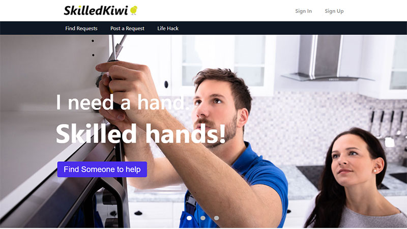
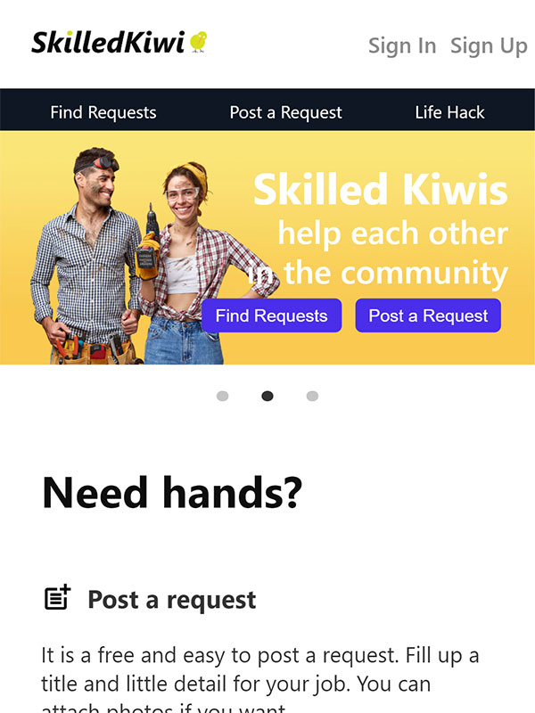

# Skilled Kiwi Client

Skilled Kiwi is a platform designed to connect skilled individuals with those in need of their help. I got the motivation from people who live alone or are old, so have to fix almost of daily issue with extremely high cost. It doesn't mean highly-professional work, but simple work many forks do on their own like lawn mowing, change light bulbs or connect Internet.

## Overview

> This application is still under development. I just provide a demo page.

- [Demo](http://skilledkiwi.netlify.app/)

  mock user ID: abcd1234

  mock user Password: abcd1234!

## Features

- Sign In [Demo](http://skilledkiwi.netlify.app/sign_in)

  mock user ID: abcd1234

  mock user Password: abcd1234!

- Sign Up [Demo](http://skilledkiwi.netlify.app/sign_up)
- Search jobs [Demo](http://skilledkiwi.netlify.app/find_requests)
- Post a job [Demo](https://skilledkiwi.netlify.app/post_request)
- View a job [Demo](https://skilledkiwi.netlify.app/request/2)

  ### To be implemented in the future

  - Bidding for jobs
  - Life Hack sharing
  - Real time chat service
  - Touch slide carousel for mobile
